# Let's Analyze ILIAS

Dieses Projekt ist im Rahmen der Veranstaltung Technologiegestütztes Lernen der Hochschule Karlsruhe im Wintersemester 2019/20 entstanden und hatte das Ziel aus Ilias exportierte Testdaten auswerten zu können, um diese zu archivieren, weiterzuverarbeiten und grafisch aufzubereiten.

Diese Anwenderdokumentation beschreibt die Nutzung der Software.

## Erste Schritte
Die Software ist web-basiert und wird auf einem Server in der BWCloud bereitgestellt. Die Webseite kann unter https://hska-tgl.dynu.net/ erreicht werden. Alle Auswertungen werden clientseitig durchgeführt. Es werden also keine Testdaten an den Server übermittelt.

Nachfolgend soll beschrieben werden, wie die Testdaten aus Ilias exportiert und auf der Webseite ausgewertet werden können.

## Export der Testdaten
Nach der Anmeldung an Ilias und Auswahl des entsprechenden Kurses kann der vorhandene Kurs ausgewählt werden.

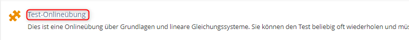

Nach Auswahl des Tests können die benötigten Daten über die Export Funktion exportiert werden.

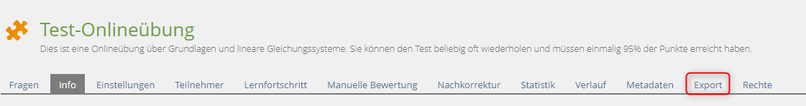

Dazu sollte im Dropdown-Menü zunächst *Erstelle Exportdatei (inkl. Teilnehmerergebnisse)* ausgewählt werden. Anschließend kann die Erstellung der benötigten Daten mit einem Klick auf *Exportdatei erzeugen* beauftragt werden.

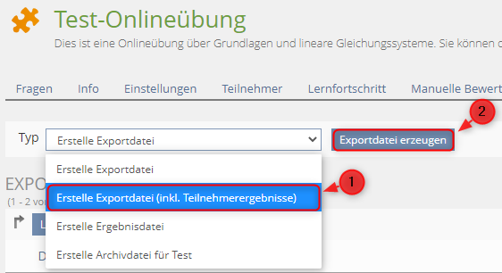

Sobald ILIAS die gewünschte Exportdatei erstellt hat, kann diese unter den Exportdateien des Tests gefunden und mit einem Klick auf HErunterladen heruntergeladen werden.

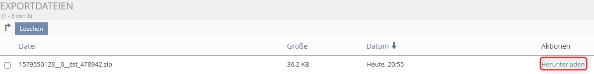

Das exportierte .zip Verzeichnis sollte einen Ordner beinhalten, in welchem sich, neben einem weiteren Ordner drei .xml Dateien befinden. Diese Dateien sollten nach folgendem Schema benannt sein:

-   \*_qti\_*.xml
-   \*_results\_*.xml
-   \*_tst\_*.xml

Diese .zip Datei kann in das LAI System hochgeladen und von dem System analysiert werden. Das Interface des LAI Systems und der Upload werden im nächsten Kapitel behandelt.

## Das Interface und die Analyse

### Das Interface

Das LAI System ist zum aktuellen Zeitpunkt wie folgt aufgebaut:

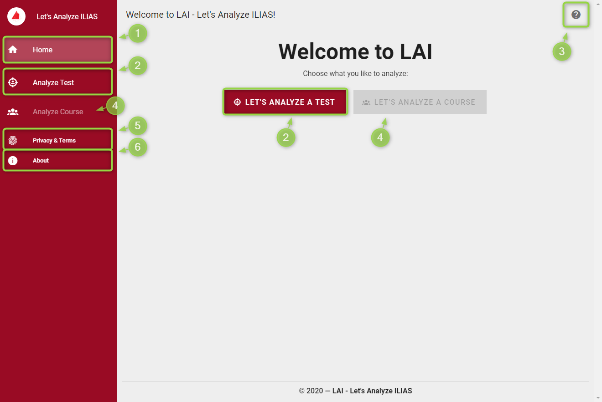

1. Über die Schaltfläche *Home* kann die Startseite zu jedem Zeitpunkt erreicht werden
2. Die Schaltflächen *Analyze Test* und *LET'S ANALYZE A TEST* starten eine neue Testanalyse
3. Über die *?* Schaltfläche kann derHilfedialog mit Informationen zum Export eines Tests aus ILIAS aufgerufen werden
4. Die Funktion hinter den Schaltflächen *Analyze Course* und *LET'S ANALYZE A COURSE* ist zum aktuellen Zeitpunkt nicht implementiert
5. Über die Schaltfläche *Privacy & Terms* können Informationen zur Datenerhebung eingesehen werden
6. Über die Schaltfläche *About* können Informationen über den Betreiber des Dienstes eingesehen werden

### Die Analyse

Nachfolgend sollen die notwendigen Schritte zur Analyse eines Testexportes beschrieben werden.

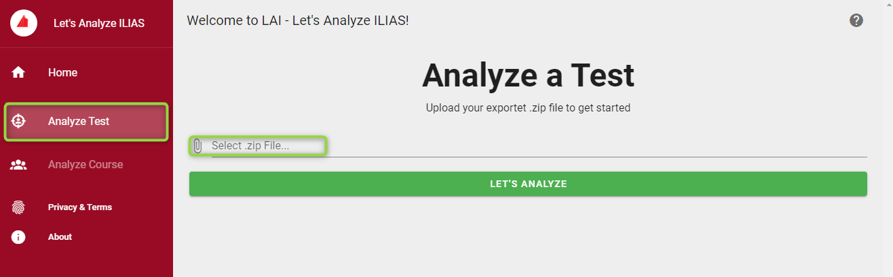

Nach einem Klick auf *Analyze Test* fordert das System die Auswahl eines exportierten Ilias-Tests.
Dazu kann ein Dialog zur Dateiwahl durch einen Klick auf *Select .zip File...* gestartet werden.

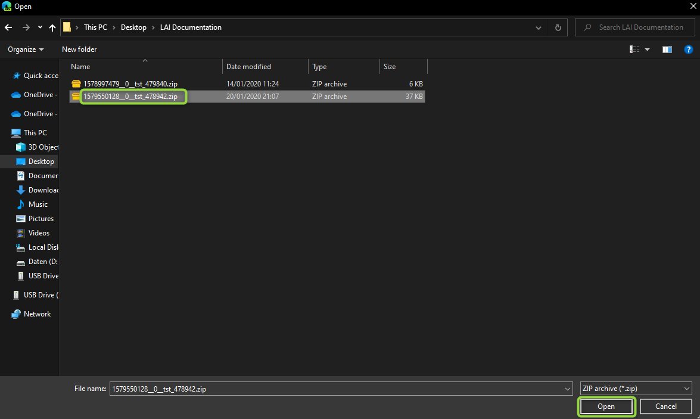

Im Dialog zur Dateiwahl sollte nun der gewünschten Export ausgewählt werden.
Nach einem Klic auf *Open* wird die Datei in die Anwendung geladen.

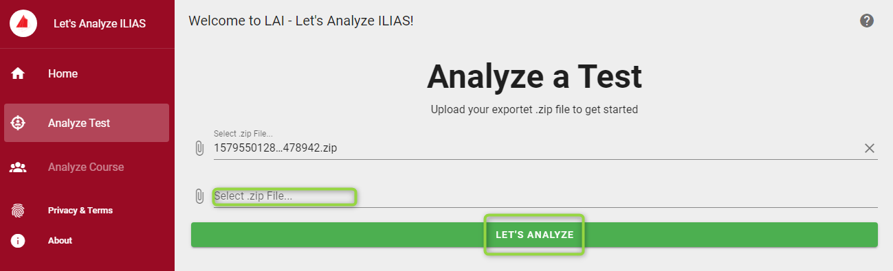

Nun kann über die Schaltfläche *Select .zip File...* entweder ein weiterer Test geladen werden, oder die Analyse der gewählten Tests kann über die Schaltfläche *LET'S ANALYZE* gestartet werden. Die Anzahl der von LAI unterstützten Tests ist nicht begrenzt. In diesem Beispiel beschränken wir uns allerdings auf die Analyse eines Tests.

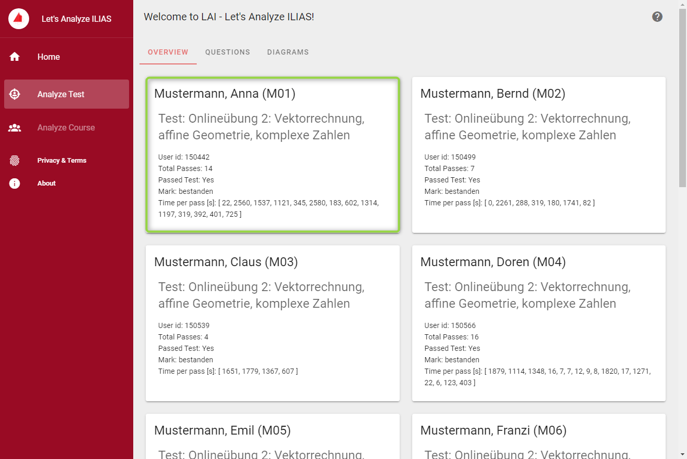

Nachdem *LET'S ANALYZE* ausgewählt wurde, wird die Übersicht der analysierten Tests dargestellt. In dieser Übersicht werden die Testdurchläufe pro Nutzer dargestellt. Dabei werden folgende Informationen für jeden Nutzer aufgeführt:

-   Name
-   Nutzer ID
-   Aanzahl der erfolgreichen Testdurchläufe
-   Wurde der Test bestanden?
-   Note
-   Zeit pro Testdurchlauf in Sekunden

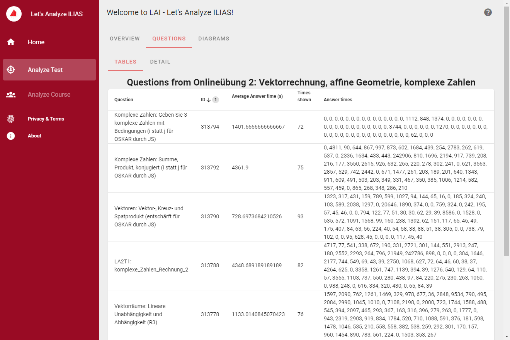

Der zweite Reiter der Auswertungen konzentriert sich auf die Fragen des Tests. Diese Auswertung ist zweigeteilt. Der erste Teil stellt die Fragen tabellarisch dar und liefert pro Frage Informationen wie den Namen, die ID der Frage, die durschnittliche Antwortzeit, wie häufig die Frage dargestellt wurde und die Antwortzeiten jedes Aufrufs.

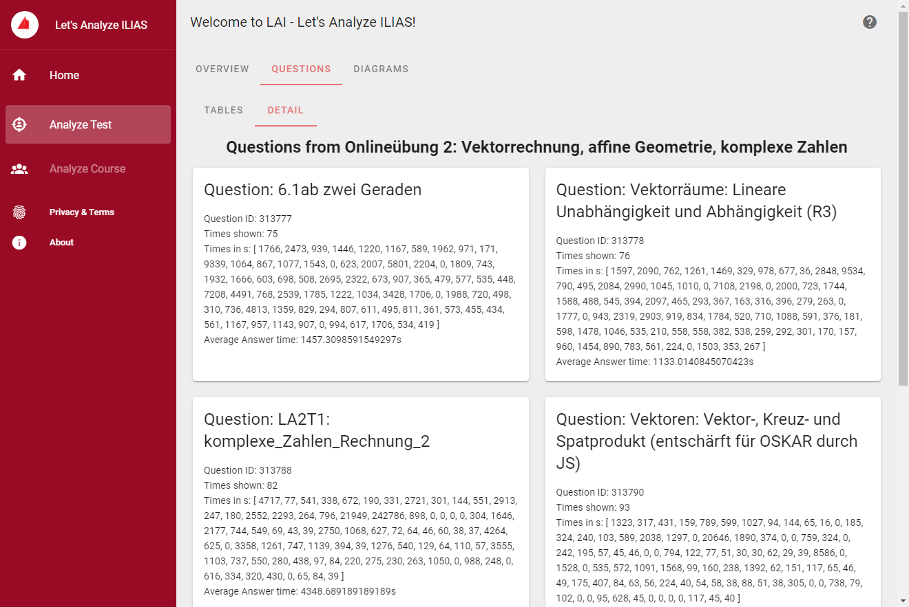

Die Detaildarstellung der Fragen beinhaltet die gleichen Informationen.

Über den letzten Menüpunkt *Diagrams* kann eine Auswertung des Tests in Form von Diagrammen dargestellt werden. Diese Funktion wurde zum aktuellen Zeitpunkt allerdings noch nicht implementiert.

## Auswertungsergebnisse

### Export der Auswertungsergebnisse
Über die Übersichtsseite der Auswertung kann die Nutzerauswertung als Excel-Dokument heruntergeladen werden. Über die tabellarische Darstellung der Fragen kann die Auswertung der Fragen heruntergeladen werden.

### Aufbau der Ergebnisse
Nachfolgend soll der Aufbau der Excel Dokumente beschrieben werden.
#### TestUsers.xlsx

Das TestUsers.xlsx Excel Dokument beinhaltet mehrere Arbeitsblätter. Das erste Arbeitsblatt besteht aus einer Übersicht aller Testdurchläufe aller Nutzer. Für jeden Teilnehmer des Tests existiert ein weiteres Arbeitsblatt. Auf diesen Arbeitsblätter werden die Testdurchläufe der jeweiligen Nutzer aufgeführt.

Die Arbeitsblätter beinhalten die folgenden Spalten:

| Spalte                     | Inhalt                                                    |
| -------------------------- | --------------------------------------------------------- |
| login                      | Kürzel des Nutzers                                        |
| id                         | Ilias ID des Nutzers                                      |
| full_name                  | Vollständiger Name des Nutzers                            |
| test_label                 | Label des Tests                                           |
| verfügbarkeit_start        | Zeitpunkt der Bereitstellung des Tests in ILIAS           |
| verfügbarkeit_ende         | Zeitpunkt des Endes der Bereitstellung des Tests in ILIAS |
| durchfuehrung_zugang_start | Beginn des Zugriffs des Nutzers für diesen Durchlauf      |
| durchfuehrung_zugang_ende  | Ende des Zugriffs des Nutzers für diesen Durchlauf        |
| erste_bearbeitung          | Zeitpunkt der ersten Testbearbeitung des Nutzers          |
| letzte_bearbeitung         | Zeitpunkt der letzten Testbearbeitung des Nutzers         |
| user_has_passed_once       | Nutzer hat den Test einmal bestanden                      |
| user_has_passed_mark       | Note des Nutzers                                          |
| number_of_passes           | Anzahl erfolgreicher Testdurchläufe                       |
| pass_number                | Nummer des Durchlaufs                                     |
| time_for_pass              | Bearbeitungszeit des Durchlaufs                           |
| time_stamp                 | Zeitstempel der Speicherung des Testdurchlaufes           |
| number_answered_questions  | Anzahl der im Testdurchlauf beantworteten Fragen          |
| count_of_questions         | Anzahl der vorhandenen Fragen                             |
| points                     | Erreichte Punktzahl                                       |
| max_number_of_points       | erreichbare Punktzahl                                     |

#### TestQuestions.xlsx

Das TestQuestions.xlsx Excel Dokument besteht aus zwei Arbeitsblättern. Das erste Arbeitsblatt beinhaltet eine Auflistung der Fragen des Tests. Das zweite Arbeitsblatt beinhaltet alle Fragedurchläufe pro Nutzer.

Die Arbeitsblätter beinhalten die folgenden Spalten:

| Spalte                    | Inhalt                                                            |
| ------------------------- | ----------------------------------------------------------------- |
| test_id                   | ID des Tests in ILIAS                                             |
| test_label                | Name des Tests in ILIAS                                           |
| verfügbarkeit_start       | Zeitpunkt der Bereitstellung der Frage in ILIAS                   |
| verfügbarkeit_ende        | Zeitpunkt des Endes der Bereitstellung der Frage in ILIAS         |
| durchfuerung_zugang_start | Beginn des Zugriffs des Nutzers für diesen Durchlauf              |
| durchfuehrung_zugang_ende | Ende des Zugriffs des Nutzers für diesen Durchlauf                |
| question_id               | ID der Frage in ILIAS                                             |
| question_label            | Name der Frage in ILIAS                                           |
| total_times_shown         | Häufigkeit der Anzeige der Frage                                  |
| average_time              | durchschnittliche Antwortzeit                                     |
| user_id                   | ID des Nutzers in ILIAS                                           |
| user_login                | Kürzel des Nutzers                                                |
| user_fullname             | Vollständiger Name des Nutzers                                    |
| question_user_pass_number | Testdurchlauf des Nutzers in welchem diese Frage aufgerufen wurde |
| question_title            | Name der Frage in ILIAS                                           |
| question_start_time       | Beginn der Bearbeitung der Frage innerhalb des Testdurchlaufs     |
| question_editing_time     | Bearbeitungszeit des Nutzers                                      |
| question_average_time     | durchschnittliche Bearbeitungszeit aller Nutzer                   |
| question_points           | erreichte Punktzahl                                               |